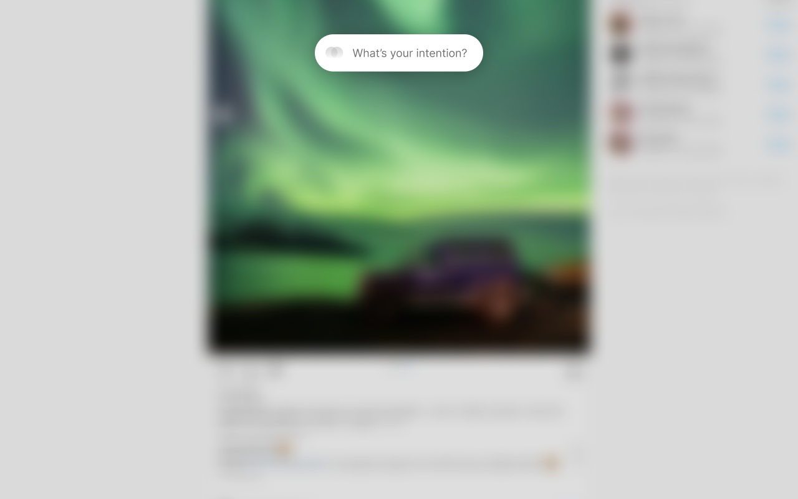

_With Intention_ is a Chrome extension that helps you browse the web more intentionally.

By simply stating your intention of selected websites every time you visit them, mindless browsing of distracting websites can be reduced and turned into a more mindful experience.

## ✨ Installation

1. Clone this repository
1. In chrome, navigate to `chrome://extensions` and enable the 'Developer Mode' in the upper-right corner
1. Add the repository to Chrome via the _Load unpacked_ button

## 📚 Background

To help you avoid distracting websites, some extensions blacklist entire websites. But, this doesn't work if you need to look something up now and then. For this reason I am a big fan of DK's [Intention](https://chrome.google.com/webstore/detail/intention-stop-mindless-b/dladanhaondcgpahgiflodhckhoeohoe) extension, which instead of blacklisting websites, _'unlocks'_ them for a certain period of time.

In my daily work though, this created a lot of _friction_ because estimating and unlocking time periods distracted me from the actual work.
«With Intention» is essentially a reduction of DK's extension: by simply and only writing down the intention when visiting certain websites, intentional working is reinforced and accidental mindless browsing is reduced.

## 📝 License

[MIT](LICENSE)
